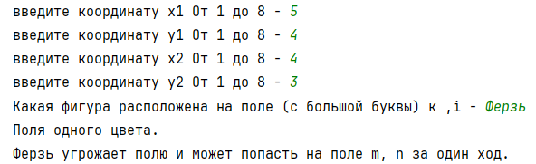
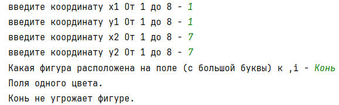
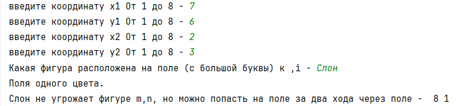

# Шахматы

### Исполнитель:

Ахтямов Даян Раисович

группа - Фт-220008

---

#### Задание:

а) Выяснить, являются ли поля (k, I) и (m, n) полями одного цвета.

б)На поле (к, I) расположен ферзь, ладья, слон или конь (должен ввести пользователь). Угрожает ли он полю (m, n)?

в) Выяснить, можно ли с поля (k, I) одним ходом ладьи, ферзя или слона (должен ввести пользователь) попасть на поле (m, n). Если нет, то выяснить, как это можно сделать за два хода (указать поле, на которое приводит первый ход).

---

Открыть проект можно в PyCharm

* Открывать нужно файл laba №3

---

### Скриншоты тестов:

